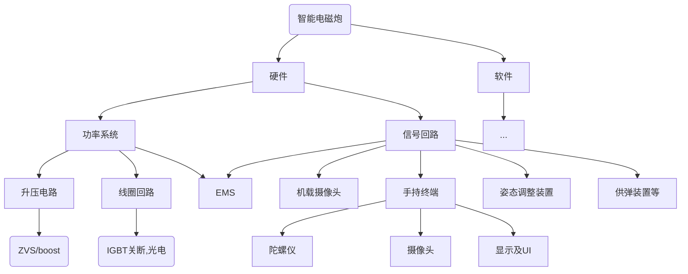
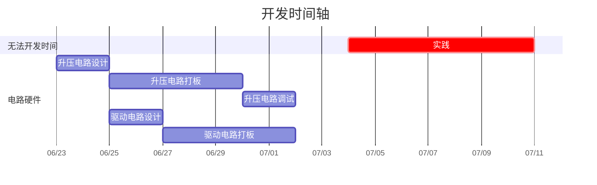

# autoE_Mgun
此为2024年硬件设计大赛小组repo
**小组成员**  张光宇  陈冠嘉  江玮陶
## 项目描述
本项目为 “自动瞄准磁阻式电磁炮台”，预计实现主要功能按优先级依次为：
1. 实现基于光电对管反馈的IGBT单管关断拓扑的磁阻式电磁炮
    - 实现升压
    - 实现光电
    - 实现系统装配
1. 实现基于stm32控制舵机的电磁炮发射方向调节功能
1. 实现摄像头检测目标自动瞄准的功能
1. 实现手持终端（“指哪打哪”）

同时还可实现的功能：
- 自动上膛机构（机械/电子？）
- ……
## 项目架构
*有待完善*

## 开发进度

### 前期准备
#### 软件下载
- 电路仿真软件 `MULTISIM14` https://cloud.tsinghua.edu.cn/d/d82f36fe9607472283ef/
- PCB设计软件 `Altisim` https://www.altium.com/ 注册账号并申请教育版
- `AutoCAD` https://www.autodesk.com.hk/products/autocad 注册账号并申请教育版
### 开发日志
**240622**
- 立项。创建githubrepo。
- 完成ZVS电路仿真设计

**240624**
- 完成组队。