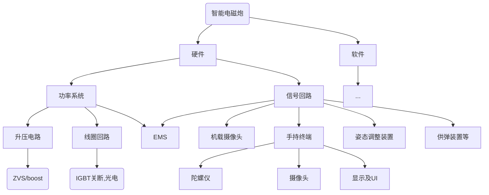

# 项目规划
## 项目分解

## 前期准备
### 软件下载
- 电路仿真软件 `MULTISIM14` https://cloud.tsinghua.edu.cn/d/d82f36fe9607472283ef/
- PCB设计软件 `Altisim` https://www.altium.com/ 注册账号并申请教育版
- `AutoCAD` https://www.autodesk.com.hk/products/autocad 注册账号并申请教育版
