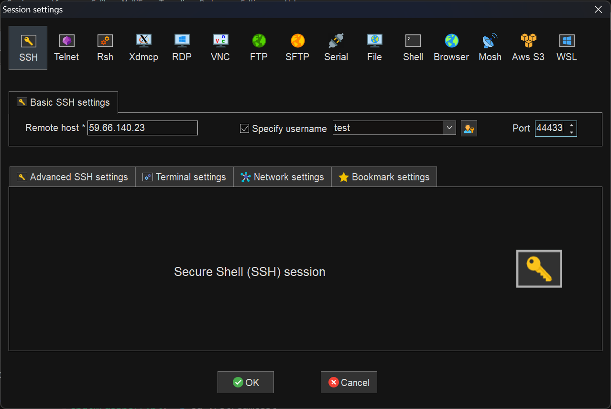

# 硬设期间服务器连接方法
## 0. 注意事项
- 自觉维护信息安全，登陆后立即修改密码（使用`passwd`命令即可），并不要肆意传播这个文档
- 服务器性能有限，请勿用作高性能用途（如：跑模型等）
- 由于资金紧缺，服务器上运行多个任务，因此请谨慎使用杀进程指令，并禁止触碰你不了解的文件
- 不要询问服务器硬件的来源

## 1. 服务器概况
服务器为一`raspberrypi4B`微型电脑，经由小米`R1C`路由器借紫荆一号楼526B网口连接至互联网。目前服务器24h不断电，除非宿舍停电（UPS开发中）。后续该机器将直接连接电磁炮作为控制系统的一部分。

## 2. 连接方法
### 方法1（推荐）
1. 下载`MobaXterm`终端软件（即电电Cadence连接所用terminal）
1. 新建session，顶部选择`ssh`，主机名填`59.66.140.23`,用户名填你的用户名,==端口填44433==,如图

1. 点击`OK`, 系统要求输入密码，输入分发的密码即可
### 方法2
`win+R`输入`powershell`打开终端，输入指令
```bash
ssh 59.66.140.23 -p 44433 -l <your_user_name>
```
后回车，按照要求输入密码即可。（`<your_user_name>`换成你的用户名
## 3. 用户名分配
|姓名|用户名|初始密码|
|---|---|---|
|张光宇|zgy|zgy123456|
|陈冠嘉|cgj|cgj123456|